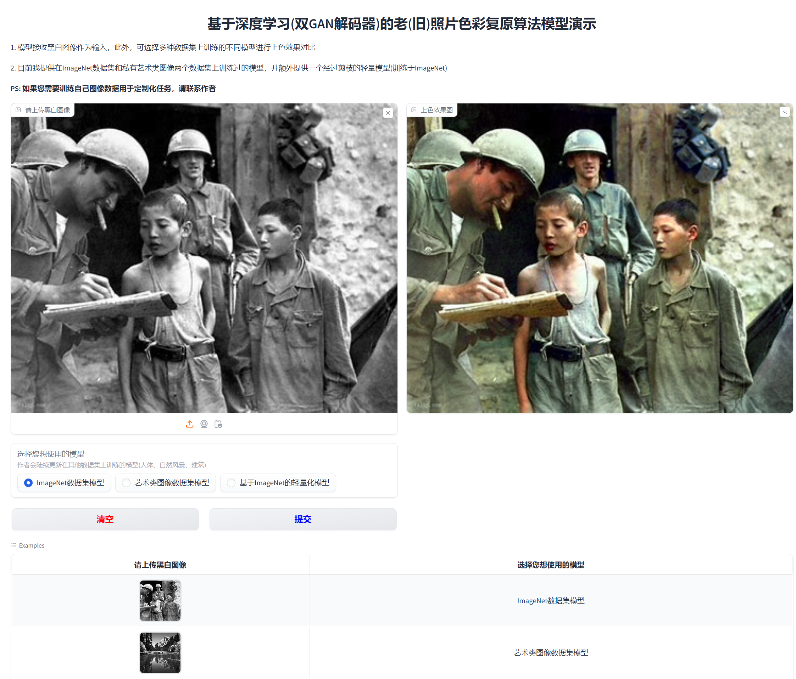

# # 计算机毕业设计-基于深度学习的老(旧)照片色彩复原、上色算法模型设计与实现（对抗生成式网络GAN、含Github代码与Web端设计）

<h3><center>更多基于深度学习的毕业设计请关注专栏 --- <a href="http://t.csdnimg.cn/ZTAtt">计算机毕业设计</a></center></h3>

<h3><center>包含图像破损修复，照片色彩增强，老照片划痕检测，视频异常检测、车牌识别、医学图像分割、目标检测等</center></h3>


## :sparkles: Demo_1


## :sparkles: Demo_2


## :sparkles: 网页端效果展示

👇
**Web端在线体验地址：**:white_check_mark:[访问这里进行图像色彩复原在线体验](http://24740w35p4.imdo.co):white_check_mark:

**在线体验地址已经集成了训练好的模型，您只需点击选择使用的模型即可！**

**:package:：在线体验使用方式：**

​	打开连接后，左侧图片输入框需要上传待修复的黑白图。**在网页下方提供了六组测试样例，您可点击样例使其自动填充到相应位置后点击提交按钮等待上色结果。**

**注意：** 修复第一张图的时候耗时较长，大约10秒左右。从第二张图开始，速度就会快起来，大约3秒左右一张（这主要是因为第一次启动的时候模型需要加载进显卡中，同时，我服务器端网络速度也对响应有一定影响）




<hr>


#### 介绍

&emsp;&emsp;图像上色是一个极具挑战的问题，因为它涉及多模态不确定性和高复杂度的不确定性。直接训练深度神经网络往往会导致语义色彩错配和低色彩丰富度。尽管基于 Vision Transformer 的方法能够生成更优质的结果，但它们通常依赖手动设计的先验，表现出较差的泛化能力，并容易引入颜色流动效应。为了解决这些问题，本课题提出了一种基于改进的双GAN解码器的端到端图像上色方法。

&emsp;&emsp;该方法包括一个像素级解码器和一个基于色彩还原查询的颜色解码器。像素级解码器恢复图像的空间分辨率，而颜色解码器则利用丰富的视觉特征进行精细的颜色还原，从而避免了对先验知识的依赖。通过交叉注意机制，这两个解码器在颜色与多尺度语义表示上进行协同工作，有效减少了颜色流动效应。此外，本研究还引入了一种简单而有效的颜色损失函数，以增强色彩的丰富度。实验证明，该模型在效果、上色速度和质量方面均优于传统的基于机器学习的模型。

<hr>

#### 运行要求

- 安装Conda环境（miniconda or anaconda）
- 安装Cuda环境
- python >= 3.10

<hr>


### 📌通过运行算法源代码获取检测结果

#### 环境配置

#### 使用conda安装环境

```
# 首先使用conda创建环境
conda create -n py310 python=3.10
conda activate py310
# 安装依赖
pip install -r requirements.txt 
```

### 测试图片

#### 方式一：启动Web端交互界面

 启动web端（会启动在127.0.0.1:xxxx的本机环回地址下)

```
python gradio_app.py
```

回车后会自动启动Web服务，在浏览器打开即可访问，在控制台看到如下信息代表成功启动👇


打开http://127.0.0.1:9091，显示如下界面代表成功！👇


#### 方式二：在cmd（控制台）批量测试图片

- 将需要测试的图片放在`./assets/test_images`下运行代码即可

<hr>

### 算法模型使用演示视频（Web前端 & 控制台）

- 由于GitHub无法上传视频，请移步至我的CSDN观看 => https://blog.csdn.net/qq_45566099/article/details/138611013

<hr>

### :wrench: 如何自己训练模型?

- 训练自己想要的定制化图像修复模型**只需要准备好针对需要上色图片的同类型图片数据即可**，具体训练方式请咨询作者


## 作者联系方式：

- **VX：Accddvva**
- **QQ：1144968929**

- Github提供训练好的模型文件以及调用该文件进行修图的测试代码（**Github开源代码中不含模型定义源码以及训练代码，只提供可供测试的模型文件，拉取Git代码后安装环境可进行上色效果测试**）
- 该项目完整代码 + 详细环境配置（如有需要可提供模型远程部署）+  Web端 + 训练方式 == 价格300RMB
- 如果你的电脑没有合适的GPU，或需要自行训练私有数据而自己的GPU现存或性能不够，作者另提供GPU服务器短期租赁服务，24G显存+64G内存云服务器每周 100RMB

<hr>

### 广告

- 作者于浙江某985高校就读人工智能方向研究生，可以帮忙定制设计模型，并提供代码和训练后的模型文件以及环境配置和使用方法，只需要描述需求即可
- 人工智能领域，尤其是计算机视觉（Computer vision，CV）方向的模型or毕业设计，只要你想得出，没有做不出的
